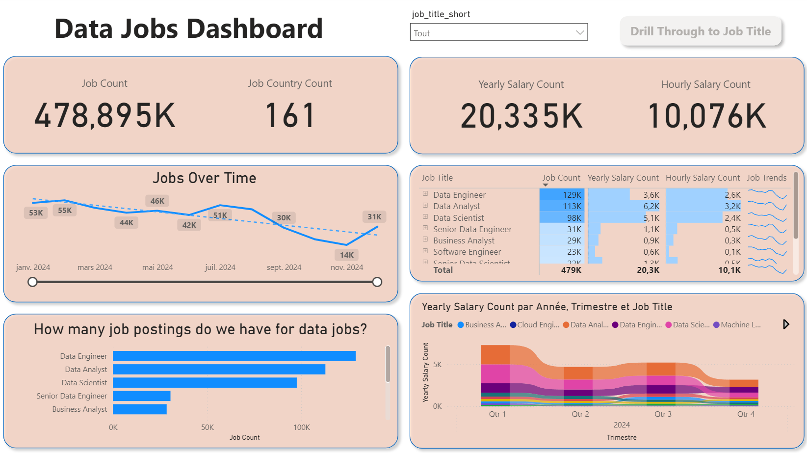
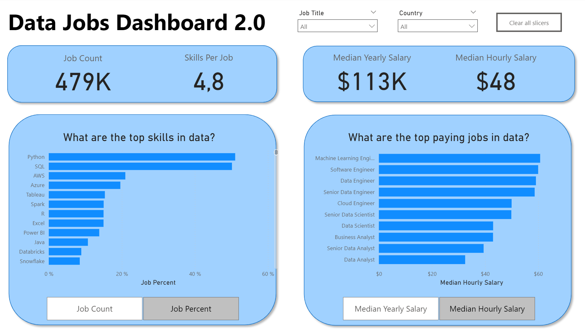

# My Power BI Dashboard Portfolio 🧑‍💻

Hello! This repository is a collection of Power BI dashboards I've developed. It tracks my journey in using Power BI, from foundational reports to more advanced interactive analyses, all aimed at turning data into clear, actionable insights.

## Featured Dashboards

Explore the dashboards below. Each has its own dedicated README with more details on the build process and specific features.

## Data Jobs Dashboard (V1 - Comprehensive Exploration)

**Key Power BI Skills Utilized:**

* 🎨 Dashboard Layout & Design
* ⚙️ Power Query (ETL & Data Shaping)
* 🔗 Basic Data Modeling (Table Relationships)
* 🧮 Implicit Measures & Standard Aggregations
* 📊 Core Charts (Bar, Line, Area, Column)
* 🗺️ Map Visualizations for Geospatial Data
* 📋 KPI Cards & Detailed Data Tables
* 🧩 Interactive Slicers for Filtering
* 🕹️ Buttons & Bookmarks for Page Navigation
* 🔎 Drill-Through Functionality

[**View Full Project 1 Details (README)**](./data-jobs-v1/README.md)

## Data Jobs Dashboard (V2 - Single-Page Focus)

**Key Power BI Skills Utilized:**

* 🎨 Dashboard Layout & Design
* ⚙️ Complex Power Query Transformations
* 🔗 Star Schema Data Modeling Principles
* 🧮 Explicit DAX Measures (e.g., `CALCULATE`, context modifiers)
* 📊 Dynamic Visualizations (driven by Parameters/Slicers) and core Charts (Bar, Line, Area, Column)
* 📋 KPI Cards & Detailed Data Tables
* 🧩 Interactive Slicers for Filtering

[**View Full Project 2 Details (README)**](./data-jobs-v2/README.md)

## About This Portfolio

Each dashboard linked has it's own readme files, click on the links to have more in-depth information about the projects themselves such as used Power BI techniques, concepts learnt, different features, etc.
